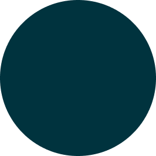

<h1 align="center">
    
</h1>

<h4 align="center"> 
  🍔  VakinhaBurger  🍟
</h4>

<p align="center">
 <a href="#-sobre-o-projeto">Sobre o projeto</a> •
 <a href="#%EF%B8%8F-funcionalidades">Funcionalidades</a> •
 <a href="#-como-executar-o-projeto">Como executar o projeto</a> •
 <a href="#pr%C3%A9-requisitos">Pré-requisitos</a> •
 <a href="#-tecnologias">Tecnologias</a> •
 <a href="#-autor">Autor</a> •
</p>


## 💻 Sobre o projeto

VakinhaBurger foi um projeto desenvolvido durante a semana Dart Week 2022 (31/01/2022-04/02/2022) onde consiste em um aplicativo de delivery em que o cliente acessa e faz o seu pedido. Então ao finalizar o pedido, é gerado uma chave pix do valor do pedido para que o cliente já possa realizar o pagamento.

A semana da Dart Week foi realizada pela [Academia do Flutter](http://academiadoflutter.com.br/)

---

## ⚙️ Funcionalidades

- [x] Pagamento por PIX
- [x] Themes
- [x] Fluxo de Login e Logout com a aplicação
- [x] GetX como Gerenciamento de Estado
- [x] Navigator 2.0

---

## 🚀 Como executar o projeto
   ```
   - Entre no diretório:
   $ cd vakinha_burger
   - Instale as dependências:
   $ flutter pub get
   - Execute:
   $ flutter run
   ```
   
---

### Pré-requisitos

Antes de começar, configure o ambiente de desenvolvimento na sua máquina, instalando o [Flutter](https://flutter.dev/docs/get-started/install)

## 🛠 Tecnologias

As seguintes ferramentas foram usadas na construção do projeto:

-   **[Flutter](https://flutter.dev/)**

---

## 🦸 Autor

 
 <span><b>Leonardo Molina</b></span>

[](https://twitter.com/leoomolina_) [](https://www.linkedin.com/in/leomolina0501/)

---
